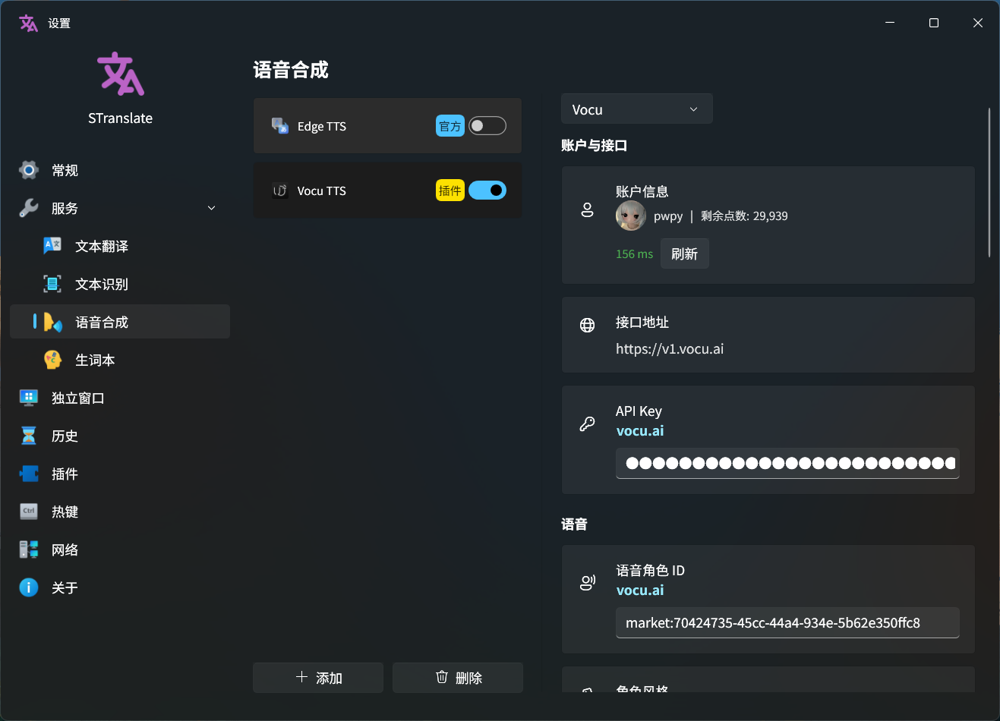
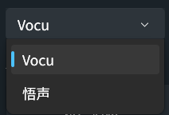
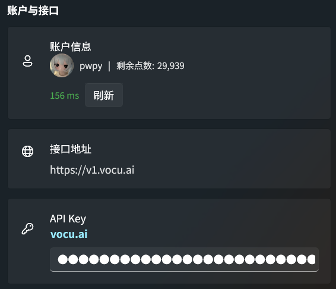
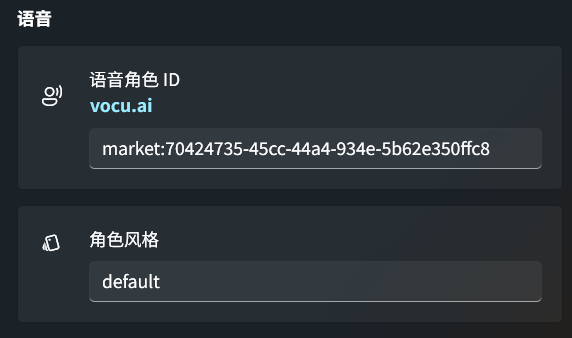
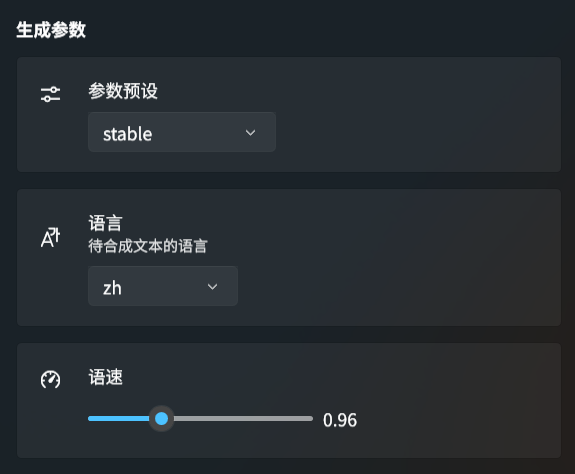
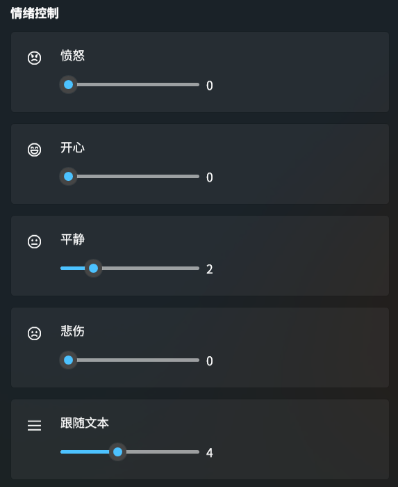
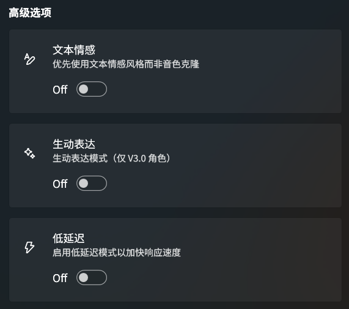
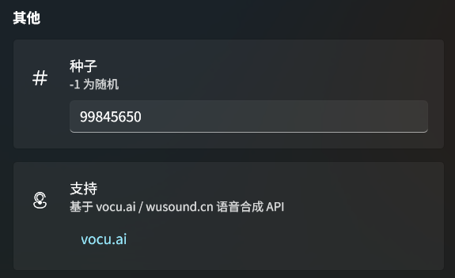

<div align="center">
  <a href="https://github.com/Cirnouo/STranslate.Plugin.Tts.Vocu">
    
  </a>

  <h1>Vocu TTS</h1>

  <p>
    <a href="https://vocu.ai">Vocu</a> / <a href="https://wusound.cn">Wusound</a> Text-to-Speech plugin for <a href="https://github.com/ZGGSONG/STranslate">STranslate</a>
  </p>

  <p>
    
    
    
    
    
  </p>

  <p>
    <a href="../README.md">简体中文</a> | <b>English</b>
  </p>
</div>

---

<div align="center">
  
</div>

## Features

- **Dual-site support** — Manage [Vocu](https://vocu.ai) (international) and [Wusound](https://wusound.cn) (China domestic) simultaneously, each with independent configuration, switch with one click
- **Emotion control** — Angry, happy, neutral, sad, context-match — each independently adjustable from 0 to 10
- **Rich generation parameters** — Speech rate, presets (creative / balance / stable), automatic language detection, seed control
- **Advanced modes** — Text emotion priority over voice clone, vivid expression (V3.0 voices), low-latency Flash mode
- **Account info** — Real-time credit balance display, avatar, API latency indicator (green / yellow / red)
- **Multilingual UI** — Simplified Chinese, Traditional Chinese, English, Japanese, Korean

## Installation

1. Go to the [Releases](https://github.com/Cirnouo/STranslate.Plugin.Tts.Vocu/releases) page and download the latest `.spkg` file
2. In STranslate: **Settings → Plugins → Install Plugin**
3. Select the downloaded `.spkg` file and restart STranslate

> [!TIP]
> A `.spkg` file is a ZIP archive. STranslate will extract and load it automatically.

## Prerequisites

Register an account and obtain an API Key from either platform:

| Site | URL | Region |
| :--: | :-- | :--: |
| **Vocu** | [vocu.ai](https://vocu.ai) | International |
| **Wusound** | [wusound.cn](https://wusound.cn) | China Mainland |

Both sites share an identical API — the same endpoints, parameters, and response format. Your configuration works the same way on either site.

## Configuration

<details>
<summary><b>Parameter reference</b> (click to expand)</summary>

| Parameter | Default | Description |
| :-- | :--: | :-- |
| Site | Vocu | Vocu (international) or Wusound (China domestic) |
| API Key | — | Bearer token for the selected site |
| Voice ID | — | Voice character ID (required), created on the site |
| Prompt Style | `default` | Prompt style ID |
| Preset | `balance` | `creative` / `balance` / `stable` |
| Language | `auto` | Auto-detect or specify a language |
| Speech Rate | `1.0` | 0.5 ~ 2.0 |
| Text Emotion | On | Prefer text emotion style over voice clone |
| Vivid Expression | Off | Vivid expression mode (V3.0 voices only) |
| Low Latency | Off | Flash low-latency mode |
| Emotion Control | `0` | Angry / Happy / Neutral / Sad / Context-match (each 0-10) |
| Seed | `-1` | -1 for random |

</details>

### Screenshots

<details>
<summary><b>UI Screenshots</b> (click to expand)</summary>

#### Site Switcher



#### Account & API



#### Voice Configuration



#### Generation Parameters



#### Emotion Control



#### Advanced Options



#### Others & Support



</details>

## Build

```powershell
# Debug build (default)
.\build.ps1

# Clean then build
.\build.ps1 -Clean

# Release build
.\build.ps1 -Configuration Release
```

The built `.spkg` is output to the repository root as `STranslate.Plugin.Tts.Vocu.spkg`.

<details>
<summary><b>Requirements</b></summary>

- .NET 10.0 SDK
- Windows (WPF project)

</details>

## Acknowledgements

- [STranslate](https://github.com/ZGGSONG/STranslate) — A ready-to-use translation and OCR tool
- [Vocu](https://vocu.ai) / [Wusound](https://wusound.cn) — TTS API providers
- [iNKORE WPF Modern UI](https://github.com/iNKORE-NET/UI.WPF.Modern) — Modern WPF UI control library

## License

[MIT](../LICENSE)
